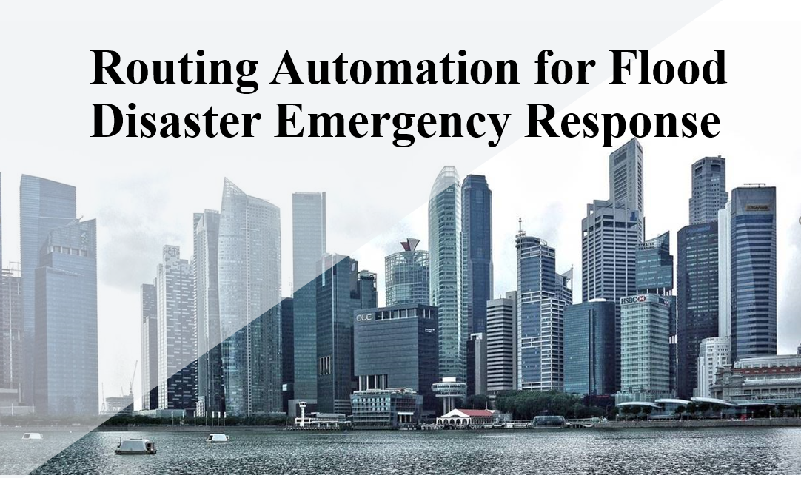
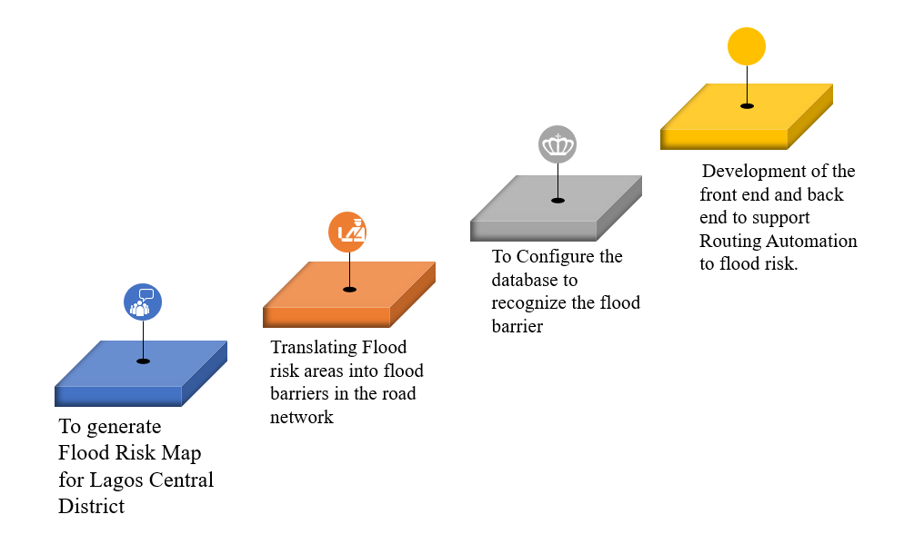

________
### Table of Contents
- [Description](#description)
- [Goal](#goal)
- [How to Execute](#how-to-execute)
- [Future Works](#future-works)
- [References](#References)
- [Acknowledgement](#acknowledgement)
- [Author Info](#author-info)

## Description
The heavy floods in Lagos, Nigeria, have shown an increasing trend in recent years. The high rate of Urbanization and inappropriate, improper land use planning are some of the main factors for this disaster, thereby leading to Lagos being selected as the case study. Geographical Information System (GIS) is integrated with Multicriteria Decision Analysis (MCDA) to evaluate the potential flood risk areas. This was used to locate the high-risk areas prone to flooding. PgRouting, which is an extension to PostgreSQL, is adopted in the study as a way to be able to navigate through these highly flooded areas, which served as barriers in the network. The occurrence of flood disaster has seriously affected navigation and emergency response services. Simulation connectivity can be greatly supported by the use of a navigation service ( such as route automation application) that helps emergency rescue (ER) units reach disaster areas on time as well as aid other road users. This project explains the steps to prepare the data by converting shapefiles into SQL files and import it into PostgreSQL/PostGIS, create routing topology, indexes, and automatically assign costs via pgRouting. Also, with these technologies, the project covers the execution of the Dijkstra algorithm to help automate the routing capabilities across the City. The project also focuses on creating a quasi-dynamic route finder for the complex Lagos City network over a web mapping application so that Client (responders and commuters alike) can easily find their shortest route taking cognizance of the cost parameter, i.e., flood risk. The proposed methodology and the results of this study provide a good basis for developing a system for route automation against flood risk in urban areas and can be successfully used for spatial city development policy. [For more info](docs/Introduction.md)

[Back to the top](#table-of-contents)
________

## Goal

### Technologies
- QGIS 3.4.15
- PostgreSQL/PostGIS/Pgrouting
- Python
- cgi-bin (Apache)
- Node js (node package manager)
- OpenLayer
- Javascript | JQuery | Angular
- CSS
- HTML
- Visual STudio Code
- Markdown
- Github

>See [Methodology](docs/Methodology.md) and [Discussion](docs/Result_Discussion.md) for more on this.

[Back to the top](#table-of-contents)
__________

## How to Execute
The [tutorial](docs/Tutorial.md) shows the process used to achieve this project.

[Back to the top](#table-of-contents)
__________

## Future Works
For detailed information on what can still be done, check the [conclusion](docs/Conclusion.md)

[Back to the top](#table-of-contents)
__________

## Acknowledgement
We want to express our gratitude to our teacher Dr. Joel Dinis Baptista Ferreira da Silva for his excellent guidance and sympathetic support throughout this research. His valuable advice was the most significant help for us during the one month we spent on doing this research. Also, we would like to appreciate his detailed and instructive comments on this research report very much.

[Back to the top](#table-of-contents)
___________

## References
See [References](docs/References.md)

[Back to the top](#table-of-contents)
__________

## Authors Info
>*Chukwuemeka Fortune Igwe (M20190646@novaims.unl.pt)*
*Edwige Mukundane (M20190649@novaims.unl.pt)*
*Feranmi Jeremiah Olowe (M20191141@novaims.unl.pt)*