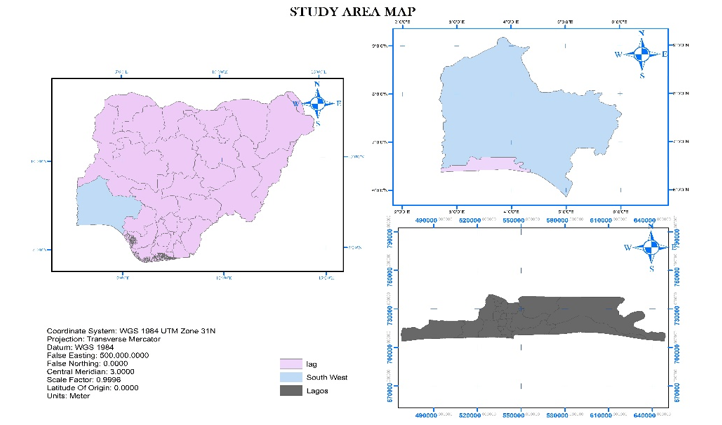

# Introduction
______________
Disaster can be referred to as an incident that occurs suddenly, complex in nature, resulting in a loss of lives, damages to property or the environment as well as affecting the daily activities of the local community. Disaster may happen anytime, anywhere, and unavoidable. However, the impact and losses of disaster can be reduced through effective management of disaster information. The effective management here means providing a tool for Emergency Response (ER) units to reach a disaster region at the right time supported by appropriate data. There are four phases of disaster management, namely prevention and mitigation; Preparedness; Response, and Recovery, and Rehabilitation.

This study is majorly focused on the flooding type of disaster. Among the natural hazards capable of causing disasters, a flood is by far the most hazardous, frequent, and widespread catastrophic event throughout the world(Floodlist,2016). Flooding can be described as a natural disaster caused by high-intensity downpours. A flood occurs when the overland flow of waters inundate land and may cause damage to crop and animals, damage to infrastructure, or even loss of human lives. This also leads to significant social, economic, and environmental impacts (National Geographic, 2018), and thereby having adverse effects on the population, and essential services, the spread of diseases, and contamination of the water supply. These impacts have drawn the attention of the government, non-governmental organizations, private organizations, and individuals to seek a strategic remedy to the damages created by this devastating phenomenon. 

This makes flooding a vital subject of study, particularly in a developing country like Nigeria.  The impacts of this disaster (flood) tend to be more severe in highly populated cities like Lagos, which is the research’s study area wherein most areas in the town, urbanization had taken place with improper land use planning and lack of early warning systems. Multi-Criteria Decision Analysis(MCDA) and GIS have been familiarized as an essential tool in spatial data analysis and mapping (Scheuer, Haase, & Meyer, 2011; Solin, 2012), which is why these tools are adopted in this study. MCDA is a few well known and acceptable methods in natural hazard modeling for analyzing complex problems in different regions. The combination of MCDA and GIS allows the integration of the three components of risk assessment: hazard, susceptibility, and vulnerability, in which the social, economic, and environmental vulnerabilities can be considered (Majumer, 2018; Chan W et al., 2014.) The outcome of this methodology is a flood risk map showing the spatial distribution of flood risk along with its intensity level, ranging from very high to very low risk.  This is well explained in the tutorial.

One of the objectives of the study is to generate a composite flood risk map that can aid decision-makers to take necessary proactive measures towards flood mitigation. However, the primary focus of this project research is to bring in routing automation to improve response and preparedness after flooding occurrence as it is the most prominent natural disasters faced by developing countries like Nigeria. The State of Lagos in Nigeria has experienced over the years this challenge, especially in the case of flood disasters, which results in considerable property losses and extensive economic damage in the form of social infrastructures. Flood disasters have time- and geographic extent that defines their impact on the environment and surroundings. This geographic extent acts as the obstruction and barriers to the network(Routing), which will help quick response by the interested agencies and commuters alike and, in turn, will reduce the effect of the emergency instantly.

*Figure 1: The study area of Lagos*

The study is conducted to develop a framework that can be used successfully in case of a flood emergency. The two critical phases of emergency management, which are response and rescue, are addressed in this project via routing automation. Information on the area is collected (road network) and then stored for future use in the database. Routes are the fastest or shortest paths along roads for visiting stops or points. These can be primary point-to-point routes visited so that the total time or distance of the journey is minimal. The management of emergency service resources in Lagos State sure requires efficient dispatch and routing strategies that provide rapid response for casualty pick up and delivery after a flooding occurrence. Therefore, the goal is to provide the shortest path between the source and the destination around the flood barriers and also the driving distance involved using various algorithms like Dijkstra’s algorithm, Astar’s algorithm via Pgrouting.

These algorithms provide advantages on time required for selecting the network and building a graph over the algorithm speed.  This Project research also explains the steps to prepare the data by converting shapefiles into SQL files and import it into PostgreSQL/PostGIS, make routing topology, indexes, and queries, dynamically assigning costs by PgRouting, and writing functions using PostgreSQL.This report provides all geospatial services with dynamic support via PgRouting, which allows clients like Quantum GIS to represent client visualization for modification of data and attributes for instantly reflecting changes via PgRouting. PgRouting Provides a framework by which cost parameters are calculated dynamically. This paper specifies the routing of Lagos city roads using Dijkstra’s algorithm and Astar’s algorithm via PgRouting in cognisance of the flood barriers. 

This article focuses on dynamic routing on the complex network like Lagos City over the web mapping application so that Client can easily find their shortest route along with Cost parameters. The WEBGIS adopted in this study based system provides information about the specific areas between two points, source, and destination, including sequence, node, edge, and the cost information.  The main aim of this research is to extend path analysis through routing. Despite various possibilities of pgRouting for path analysis, a little research is done on its usages for emergency management. Most of the existing research focuses on its usability on finding the shortest path based on some cost. In our paper, we have done an extensive path analysis to give the most concise and alternative path based on disaster conditions affecting road networks such as the occurrence of sudden floods.