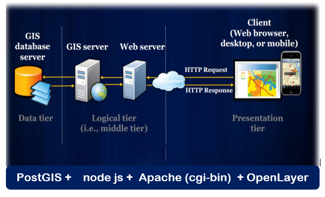

# Methodology
______
### 2.1 	Data Used
The materials are composed of QGIS 3.4.15 software used to develop the thematic theme maps. Various datasets were used to execute the Flood Hazard and Flood Risk map, including DEM, and other secondary data from multiple sources, as shown in Table 2.1.
>*Table 2.1 Data source utilized for the project*


### 2.2	Thematic Map Preparation
This stage involves building thematic information layers from different sources. Although it is difficult to uniformly select factors to be applied to assessments of flood vulnerability and flood hazard, as many researchers have noted, some essential variables play a decisive role in flood risk mapping, as can be seen from previous studies by Nigusse & Adhanom, 2019. Various geospatial data sets like land usage, elevation, rainfall, slope, flow direction, flow accumulation, water table, population density, building density, and road density were considered as reasonable indicators. The main advantage of using GIS for flood analyses is that it not only provides flood visualisation but can also analyze these events further so that possible damages due to flooding can be estimated. The Multi-Criteria Decision Analysis (MCDA) integrated GIS provides decision-making with more versatility and precision to determine the factors that cause floods effectively [Yahaya, 2008](References.md).


*Fig. 2.1 Methodology schema*

Risk referred to as a product of hazard (physical agent and its impact) and vulnerability (susceptibility to damage or injury) [Alexander 1997](References.md). Two steps are involved in developing a flood risk model: hazard assessment and vulnerability assessment. In terms of severity and frequency, hazard assessment deals with the characteristics of the event itself. While vulnerability assessment takes into account the effects of the event on the population, it takes into consideration social, economic, and environmental aspects and impacts on transport infrastructure [Ilorme, 2007](References.md). The following risk equation [Shook, 1997](References.md) is applied to assess the flood risk for the study area.

`Risk = Hazard * vulnerability			…(1)`

Where Hazard - refers to the probability of a happening flood in an area, and Vulnerability - refers to the degree of exposure with maximum value. 

As stated earlier, an essential stage in this study is the selection of parameters for determining the hazard of flooding. The flood hazard in this research takes seven parameters as a major cause of flooding in the local Lagos Central region from a previous study by [Nigusse & Adhanom](References.md), 2019 titled *“Flood Hazard and Flood Risk Vulnerability Mapping Using Geo-Spatial and MCDA around Adigrat, Tigray Region, Northern Ethiopia.”* Elevation plays a vital role in flood spreading and flood depth in the bottom catchment area [Stieglitz, Rind, Famiglietti, & Rosenzweig, 1997](References.md). The slope is another independent parameter that can accelerate both soil erosion and surface runoff, and vertical percolation [Youssef, Pradhan, & Hassan, 2011](References.md).

In QGIS, both parameters, elevation and degree slope, were derived from ASTER DEM (30 m spatial resolution). In each range, the elevation database was reclassified into five groups, i.e., less than or equal to 4, 4–14, 14–26, 26–40, and less than or equal to 68. Also, the land's slope has a significant role in determining the rush speed and vertical percolation rate of the soil. The slope was classified into five categories in the degree database, such as less than 0.409, 1.158, 2.145, 3.507, and also 8.682.

Infiltration or the vertically downward flow of water has a profound impact on flood incidence. Areas dominated by vegetation, particularly tree vegetation/forests, which are known to induce high infiltration rates, eventually have low susceptibility to flooding, thus having a negative relationship between flood occurrence and density of vegetation. Due to impermeable surfaces, the surface runoff is very high in urban and built-up areas. So land use/land cover is an essential factor in measuring flood sensitivity [Norman et al., 2010](References.md).  After being clipped to the study area, the entire study area had eight classes, including open water, tree cover areas, shrub cover areas, grassland, cropland, vegetation aquatic or regularly flooded, and impervious built-up areas [see Tutorial.md](Tutorial.md). 

Rainfall is also one of the most important parameters when studying flood occurrence. It is a time-dependent parameter, which is represented by a continuous layer. Also, the water table directly affects the ground's infiltration. Land areas with a presence of water become saturated rapidly, and water accumulates and spreads to its surroundings in regions with a low level of groundwater. The parameters chosen in this paper are based on the data available and tailored to natural and social objective conditions in the region under review, i.e., Lagos Central district. The methodology used allows other criteria not familiar to most research to be included. This includes flow accumulation, the flow direction, and the like which were derived from the DEM.

The assessment of vulnerability is a complex process because of various environmental, cultural, social, or even political elements at the local level [Gigović et al., 2017](References.md). Many other factors affect vulnerability: conditions of the settlement, infrastructure, policy and capacities of authorities, social inequalities, economic patterns, etc. For these projects, we dealt with four flood vulnerability variables, which include Land use land cover, population density, road density, and building density. In addition to the various parameters listed above, the flood-risk analysis is determined using multi-criteria evaluations (MCE) of the hazard and vulnerability assessment

### 2.3	Classification and Factor Standardization
Given that the data were collected in different ways and had different formats, all datasets have to be standardized and made in units that can be compared (scale). Here, we standardized the various factors using a scale/score between 1-6 classes based on further research and understanding of the factors from other literature. Eventually, the flood hazard map was created from all seven thematic layers, while the vulnerability is created from four thematic layers, together with their uniform weights, which were incorporated with QGIS software in the demarcation of flood risk. A weighted sum approach was used to calculate the total weights of different polygons in the built-in layer [see Tutorial.md](Tutorial.md) to obtain the vulnerability and hazard map, respectively.

```Python 
〖FH〗_Zone=〈 SLwSLs + ELiwELis + FAwFAs +  LULCwLULCs + FDwFDs +  APwAPs  + WTwWTs〉   … (2)
〖FV〗_Zone=〈LULCw LULCs + BDwBDs  +  PDwPDs  + RDwRDs + ⋯〉  			… (3)
```
Where FHZone and FVZone = Flood Hazard zone and Flood Vulnerability zone, Eli = Elevation, SL = slope, FA = Flow Accumulation, FD = Flow Direction, LULC = Land Use Land Cover, AP = Annual Precipitation, WT = Watertable,  BD = building density, PD = Population Density, RD = Road Density, the subscripts w and s refer to the normalized weight of a factor (theme) and the standardized weight (score) of individual features of the theme, respectively.

### 2.4 Weights assignment
The weight for this project was assigned based on the approach from the research of [Nigusse & Adhanom](References.md), 2019 titled *“Flood Hazard and Flood Risk Vulnerability Mapping Using Geo-Spatial and MCDA around Adigrat, Tigray Region, Northern Ethiopia.”* In their research, after getting insight from experts in the relevant area of discipline and literature review to define the factors necessary based on availability, they determined the value impact of the variable.  Finally, they carried out a linear combination formula based on Satty. This was done by multiplying parameters normalized weighted value (PNWV); the effect of the variables is calculated by 100% and is shortened to PNWV * 100%. In our case, QGIS was utilized by applying the weight value obtained from the literature using the weighted sum (linear combination) technique to create the flood risk map, taking into consideration the hazard and vulnerability assessment. 

### 2.5	System Architecture Design
The conceptual system architecture, as shown in the figure below, presents the multi-mapping server and distributed spatial database paradigm. A generalized Web-GIS architecture includes three basic components: the client layer, the server layer, and the data layer.


Fig. 2-5 – Shows the Systems Architecture Design

##### 2.5.1 OpenLayer API
OpenLayer is an open-source, client-side JavaScript API for making interactive web maps, viewable in nearly any web browser. Since it is a client-side library, it requires no special server-side software or settings. OpenLayer API allows building entire mapping applications from the ground up, with the ability to customize every aspect of your map—layers, controls, events, etc. 

##### 2.5.2.	Apache Tomcat  
It is an open-source Web server and servlet container. Tomcat was the project of Sun Microsystems, which was later handed to the Apache Foundation. It is widely used by applications that are developed using JSP and servlets. Apache Tomcat serves a Web application implemented using the Model-View-Controller design, through the well-known frameworks Spring (for the model) and Apache Tapestry (for the View and the Controller).  

##### 2.5.3.	Node js 
Node.js is a server-side JavaScript environment for network applications such as web servers. The project Node.js, under the direction of the Node.js Foundation, is funded by the collaborative projects of the Linux Foundation. The distinction between Node.js and other popular web servers is the key way to build network applications is by using a cross-platform runtime environment. Node.js implements an asynchronous I/O event-oriented architecture. Such design choices optimize web application efficiency and scalability to enable communication and browser games in real-time. Node.js also points out that Node.js specifically uses HTML, CSS, and Javascript stack in web development stacks, as contrasted with Apache or NGINX, which are part of many of the different stacks of the program. To fully utilize the capabilities of Node js, the compatible client software must be used. OpenLayers is client-side software that is widely used with Node js.

##### 2.5.4.	Python
Python is an object-oriented, interpreted, dynamically-typed, and interactive programming language. It is a platform-based architecture supporting all common operating systems. It can be used for full-stack web development, machine learning, data science, and so on. This architecture promotes the creation of web applications through the use of a web server, SQL database, and web interface. It enables us to create, edit, deploy, and manage web apps via web browsers. In this project it acts as the interface and service that computes the route by accessing/connecting to the database based on the users request, i.e., when request has been served.

##### 2.5.5.	PostGIS / Pgrouting / PostgreSQL 
PostGIS is a project spearheaded by Refractions Research. The first version of PostGIS was released in 2001. PostGIS is a spatial database that is built on top of a standard database PostgreSQL. PostgreSQL provides transaction management, disk storage routines, SQL processing and planning, and other tasks of a standard database, while PostGIS provides spatial types, functions, and indexes (Ramsey, 2011). PostGIS adds spatial data types like points, line strings, polygons, multipoint, multiline strings, multipolygons, and geometry collections. It supports both geometry and geography types. It also adds spatial functions like area, distance, union, difference, buffer, touches, intersects, within, contains, overlaps, etc.

PostGIS is a complete system, probably the most used actually in a computer environment to use with GIS applications. There is the possibility of adding pgRouting extension to provide geospatial routing functionality with routing algorithms. Pgrouting is a PostgreSQL extension for network routing creation and graph analysis applications. It is based on PostGIS, the geospatial extension for PostgreSQL. It is a body of work implemented by PostgreSQL. By using pgRouting, the shortest path question only becomes the execution of the response function. With pgRouting, there are more functions to validate and monitor the completeness of any network.

### 2.6.	IMPLEMENTATION AND DEVELOPMENT 
Designed systems architecture was implemented for solving the problem of visualization, manipulation, and quick access to the shortest path in Lagos Central. 

For the implementation of the designed system architecture, a geospatial database was created using the pgRouting/PostGIS Spatial Database Management Software. All geospatial data encoded into vector formats were imported into the PostGIS database except for the road network, which was introduced into Postgres by osm2po tool. With the pgRouting, the routing geometry recognises turn restriction and barriers by giving any such segment values that are greater than a million because all the routing algorithms such as Dijkstra and astar searches for the minimum shortest path when the cost parameter is computed (accumulated) across the chosen path.

Node js (mapping server) was installed in the same location (C:/ drive) with the PostGIS database system and acts as a map server that renders spatial data called up from the PostGIS database as well as acts as a cross-platform runtime environment to build network applications. Apache (webserver) is installed in a centralized system that acts as a web server used for integrated visualization and takes the response and request via the cgi-bin, which accepts the script folder.  

OpenLayer API was used on the clients’ side as a front end map API for further visualisation and composition of the geospatial features called up from the PostGIS database via Python script and the cgi-bin. OpenLayer API, a map is a collection of data layers and various controls for dealing with user interaction. A map is generated on the web page by four components: loading javaScript libraries, markup, style declarations, and map initialization code. 

The implementation focuses only on WFS layer. The application also accommodates the visualization of updated geospatial data in their respective PostGIS databases, which can be seen in the [Tutorial.md](Tutorial.md).
