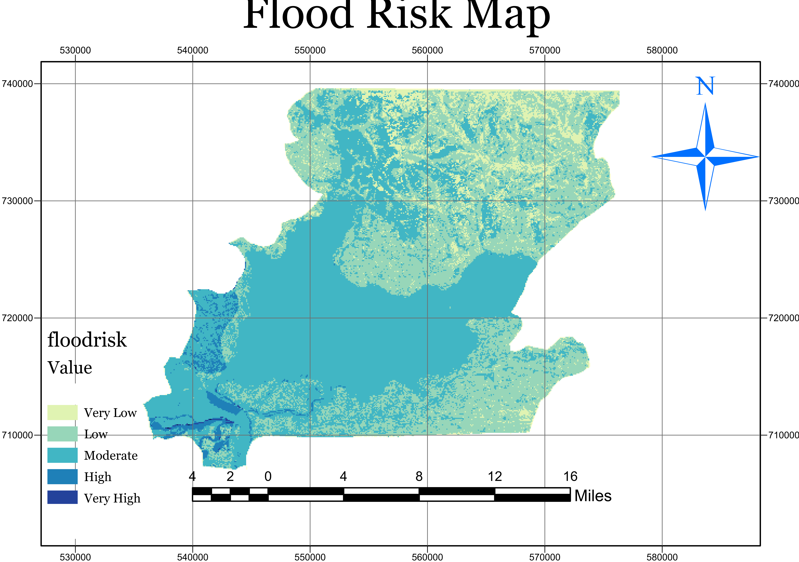
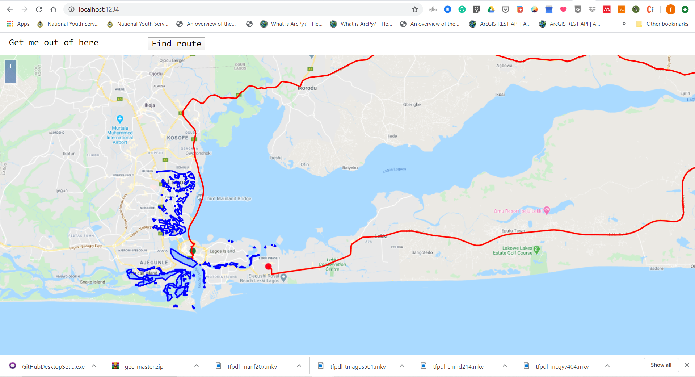

# Results and Discussion
----
The final flood risk map, as stated, is based on the flood hazard map and the flood vulnerability indicators. The study area was classified into five separate classes (zones) representing: very low, low, moderate, high, and very high flood risk areas <Fig. 3.1>. The flood risk region defines the areas where the internal structure and the physical configuration or use of the earth is most vulnerable, as well as the underlying land physical activity being carried out in such location. The part of the moderate flood risk zone is roughly 439km2 (51.7%) and shows the highest proportion in the whole region of the area. It occupies the centre of the study area, which comprises of  Lagos Island, Lagos Mainland and the inland river directly running into the Atlantic ocean and can be found in small patches or strips in other LGA (Fig. 4.1). 
The high flood risk area is located mostly across the West and South-Western sections and occupies an area of about 17.263 km2 (2%) of the study area. Low and moderate flood risk areas characterise the Eastern zone while the North, which is Ikorodu LGA, is vulnerable to three classes of flood risk, especially the very low risk, which can be negligible. For this project, the most pertinent was taken as the high and very high-risk areas. 

###### *Figure 3.1. Groundwater potential zone (GWPZone) map* 

Based on our project aim, we decided to work with all flood risk areas beyond the moderate flood risk classification. Hence, we were left with high and very high-risk regions to use for the development of the WebGIS route automation. By using the OpenLayer API, and then hard coding the CSS (styles.css) and JavaScript (index.js) automatically aligned and adjusted the layout of components and controls to maintain a uniform appearance and hence satisfying user experience (UX). Furthermore, the development cost was minimized as focuses were placed on core functionalities and customizable contents, instead of variations of frontend interfaces and layouts across the platform. Green pin indicates that endpoint, while the red pin represents the start point, to obtain the appropriate route between the two points from the pgRouting database. The flood risk serves as barriers and is loaded as the web app opens.

###### *Fig 3.2 Example of the route between two selected points avoiding the flood risk areas.*
