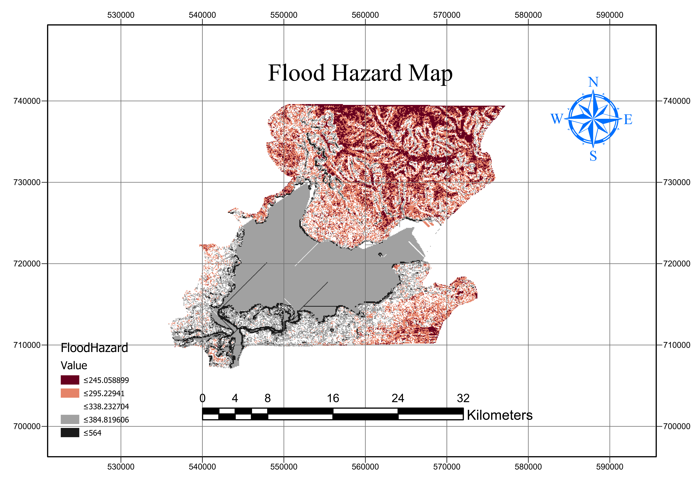

## Developing the Flood Risk Map
First of all, the indicators of flood vulnerability and hazard were downloaded from various data sources. These data were used to create the individual indicator maps using different spatial analysis and processes that exist in the QGIS software. It is important to note that since flood vulnerability and hazard are components of flood risk, as stated earlier in the report, they were first obtained before combining them to achieve the final risk map.
#### 1.1 Generation of Flood Hazard Map
To create the vulnerability map, we overlaid the rainfall map (Annual precipitation), Land Use Land Cover Map, Digital Elevation, Slope, Flow direction, Flow accumulation, and Water table. 

##### a)	Annual Precipitation-Rainfall Map
The following steps were utilized; 
i.	After importing the rainfall data as well as other data layers into the QGIS working window via the Layer tab.

>*Fig 1.1 Importing the raster and vector data into the QGIS environment*
 
From the rainfall raster data obtained in .tiff format, the Composite band was built using the tools via this directory `Grass >> r.Composite >>  Selection of the 12 bands` that make up 2018 rainfall data and creating the `AnnualRainfall2018.shp`.
ii.	From the AnnualRainfall2018.shp, we then summed the band using the value of precipitation, and then it was reprojected to the WGS 1984 UTM ZONE 31N.
iii.	Then with the Raster pixel to points, we obtained the point value, which was then interpolated using the kriging method `(SAGS >> Raster Creation tool)` to get the surface.
iv.	The final Rainfall map was then obtained by Extraction by Mask over the study area `(Extraction >> Extraction >> Clip by Raster by Mask Layer)`.

>*Fig. 1.2 Rainfall Map*

##### b) Land Use Land Cover Map
The following processes were utilized to produce the map.
As stated in the other document, the Land Use Land Cover map was downloaded already prepared. The only primary spatial processing that was done was the clipping of the raster with the study area and the resampling the raster to the size of the chosen spatial unit of analysis of 92.2445.

>*Fig. 1.3 Land Use Land Cover Map*

##### c)	DEM, Slope, Flow Direction and Flow Accumulation Maps
In practice, the slope, flow accumulation, and flow direction map are extracted from the elevation map. To achieve the individual indicator map, first, the Fill nodata tool was used to remove the sink from the DEM downloaded. With this, the Elevation map was obtained. For the slope Map, the Slope tool found under the Analysis toolbar located in the Raster Tab was used. Next, the Flow direction and Accumulation Map were created using the tools found in the directory `Toolbox >> Grass >> Raster >> r.flow and Toolbox >> SAGA >> Simulation >>  Flow accumulation tools respectively`.
   
>*Fig. 1.4 (a) Elevation Map (b) Slope Map (c) Flow Direction Map (d) Flow Accumulation Map*

##### d)	Water Table (Groundwater)
The map of the water table was obtained from the global aqueduct map downloaded by using the `Clip tool`, `Rasterize tool`, as well as the `Resample tool`.

>*Fig. 1.5 Watertable Map*

The final flood hazard map, as stated, is based on the seven thematic layers, as described and shown in `Fig. 1.2 – Fig. 1.5`. The study area was reclassified into six separate classes (zones). This was obtained using the Reclassify tool in the QGIS software for each of the seven thematic indicators discussed below. The reclassification method was similar for each layer as they involve the same process. The process utilized for each layer involved:

* Getting the `Reclassify by Table tool` from `Raster` found in the `Toolbox` via the `Processing tab`. When the pop-up appeared, the various indicator map in raster format for the flood vulnerability was inserted and reclassified based on its relationship (direct and inverse) on flood hazard for the study area.
* It is important to note that Slope, the elevation is inversely proportional to flood hazard while flow direction, flow accumulation, rainfall occurrence zones, and water table (groundwater) level is directly proportional to flood hazard. For the reclassification of the Land Use Land Cover (LULC) class, we utilized the characteristics of each land use type with apriori knowledge that building and impervious surfaces are prone to flood hazards compared to open water, which is a composed of the same constituent as a flood.
* The different classified outputs from the individual indicators were all within the value of 1 and 6 as gotten from the research of `Nigusse Adhanom`, 2019 titled *“Flood Hazard and Flood Risk Vulnerability Mapping Using Geo-Spatial and MCDA around Adigrat, Tigray Region, Northern Ethiopia.”* 
* Next, we carried out the Weighted sum raster overlay via `Raster Calculator << Raster Tab` in QGIS using the following syntax: 
    FH𝑍𝑜𝑛𝑒 = 〈 𝑆𝐿𝑤𝑆𝐿𝑠 + E𝐿𝑖𝑤E𝐿𝑖𝑠 + FA𝑤FA𝑠 +  𝐿𝑈𝐿𝐶𝑤𝐿𝑈𝐿𝐶𝑠 + FD𝑤FD𝑠 +  AP𝑤AP𝑠  + W𝑇𝑤W𝑇𝑠〉	...   1
Where FHZone = flood hazard zone, SL = slope, El = Elevation/DEM,  FA = Flow Accumulation, FD = Flow Direction, AP = Annual Precipitation (Rainfall), WT = Water table (groundwater potential), and the subscripts w and s refer to the normalized weight of a factor/indicator (theme) and the standardized weight(individual reclassified output - score) of individual features of the theme, respectively.

      
>*Fig. 1.6(a)-(g) Reclassified Map of the Flood Hazard Indicators*

Finally, to achieve the final output, the output of the weighted sum analysis was reclassified via Reclassify by Table tool into six classes, as can be seen in the map shown below.

Fig 1.7 Flood Hazard Map

#### 1.2       Generation of the Flood Vulnerable Indicators
This includes population density, Land Use Land Cover, building density, and road density. Just as the indicators in the flood hazard map, the following indicators and factors were created using the QGIS software. Below are the processes utilized:

##### a)	Population Density
For the vulnerability to be ascribed to the city, the human component is usually taken into cognisance and hence the reason for the population density factor. This was obtained by the fusion of the administrative data (admin data) of Lagos obtained downloaded from the [humdata](https://data.humdata.org/dataset/nga-administrative-boundaries) and the statistical information about some of the local government areas (LGA) of the Lagos Central District was obtained from [CityPopulation](https://www.citypopulation.de/php/nigeria-metrolagos.php). To achieve the actual population density raster map, the following step was taken, which includes:

*	First, the admin data was imported into the QGIS environment. We extracted the Lagos Central district LGAs from the admin3.shp as a new shapefile consisting of just five LG. Next, a new attribute field (column header) was created by right-clicking on the new shapefile with the environment in edit mode and by turning on the Field Calculator.
*	In the new window, we created three new fields, i.e., *the population field, area_km2 field, and PopDensity field*. In the population field, we manually inputed the population of each LGA as recorded from the website, written earlier into the cell in the attribute table. In the area_km2 field, we computed the polygon area of each of the LGA by selecting the area geom from the field calculator window. The final field, PopDensity, was calculated using the mathematical operator division.

>*Fig. 1.8 Field Calculator to create the population density attribute field*

*	Then we obtained the obtained administrative data of the study area (a single feature shapefile) using the Dissolve tools using the name_1 field on the earlier six features.
*	The newly created dissolve shapefile was then imbued with the PopDensity value of the different LGA by using the `Join attributes by Location Tool` in the `Vector general toolbox` using the *Geometry type => within* and *Join type => Take attributes of the first located feature only (one-to-one)*.
* The final map was created by using the `Rasterize tool` in `Vector Conversion Toolbox`. Then we ranked the data based on population density, knowing that the higher the population pressure, the higher the vulnerability of such class of people when a flood occurs.

 
>*Fig 1.9 (a)Population Density Map and (b) Population Density Reclassified Map*

##### b)	Building Density
The building density was extracted from the LULC map, which had the building land-use type. The steps in obtaining the building density map include:
* First, the LULC map was polygonised by using the `Polygonized tool` found in `Raster Tab >> Conversion with the Name of the Field to create` *=> Descr_* created as an attribute field in the shapefile using the documentation records obtained with the data when downloaded.
* Next, we dissolved the new vector into the first eight classes, as was in the raster form using the Descr_ field. From there, we removed all other LULC types except the building Land Cover. After this, we used the individual LGA shapefile to clip out the Building Land Use to obtain building area per LGA.
* Next, we created fields for building, area_km2 (LGA), and the BuildingDen field of computing the Building Density per LGA size area in the Building shapefile.
* After computing the fields, we used the `Join attribute by location tool` to merge the BuildingDen field in the building shapefile with the individual LGA attribute field. This output was then combined to form a single layer containing the LGA of interest.
* Next, the Merged shapefile was then converted to raster using the `Rasterize tool`.

  
>*Fig 1.10 (a)Building Density Map (b) Building Density Reclassified Map*

##### c)	Road Density
The road map was obtained from the [turbo](https://turbo-overpass.eu). The Road density map was downloaded in the geoJSON file format. This was then converted into the ESRI shapefile format. The individual LGA clipped the Road network map in the local Government central district. The following steps were utilized to create the road density raster map.
* We created new three new fields in the Individual LGA features which include, the road, area_km2, and the roadDensity fields. These fields were populated and then dissolved into the individual LGA shapefile.
* The new shapefile is then merged with the Merge tool to create a single layer with the six features. Next, this feature was converted into a raster image using the Rasterize tool. 
  
  
>*Fig. 1.11 (a)Road Density Map  (b) Road Density Map Reclassified*

##### d)	Land Use Land Cover Map (LULC)
The LULC map that was utilized for the flood hazard map was also used again as it is an important criterion to achieve the final risk map as it shows vulnerability like the above criteria. See <LULC above>

>*NOTE:* All the indicators/factors were resampled to 92.2245493044474 for both the Cell Size X and Y. Also, we made sure all coordinates were checked correctly and projected when needed to the `EPSG:32631  - WGS 84/ UTM Zone 31N` projected system. Finally, the output indicator raster maps, as well as the flood vulnerability map and the flood risk map, were adequately fit to the Lagos Central District administrative boundary using the `clipped raster by mask layer tool`.

#### 1.3	Flood Risk Map
The weighted overlay tool was executed using the Raster Calculator query builder to integrate the rates and weights and to generate a flood risk of the Lagos Central District. Logical operations combined the criterion maps, and criterion values were created based on previous research work of the same theme for each evaluation unit. The execution of the weighted sum is similar in principle as that in equation one above.

The risk map that was obtained was ranked from class 1- 5, with the highest risk being six and the least risk areas being 1. The result was then Polygonized using the Polygonized tool, and then the dissolve tool was applied to merge all the individual risk classification created as a result of the previous process earlier done, i.e., vectorization. From here, we decided to work with flood risk areas, not less than the class 4 risk.

 
>*Fig. 1.12 Flood Risk Map of the Lagos Central Area

###### [Back to the top](#developing-the-flood-risk-map)
| [Go Back](Tutorial.md) |
----
_______