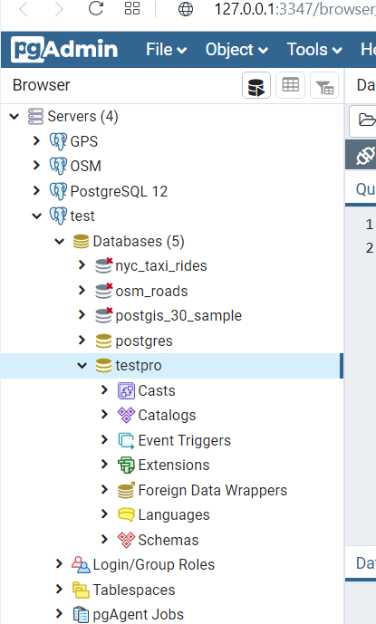
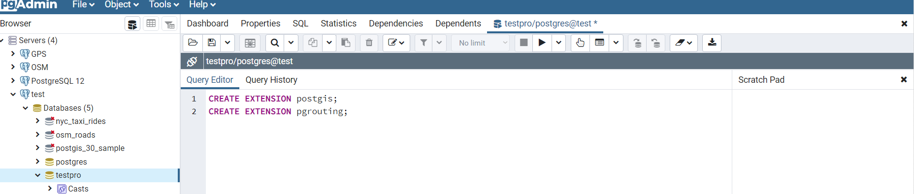
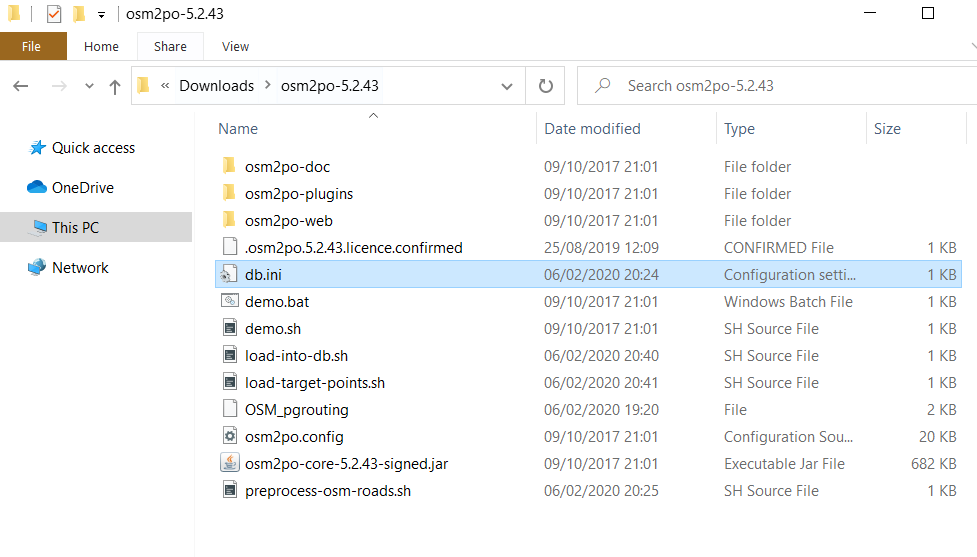
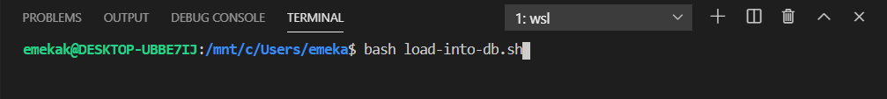
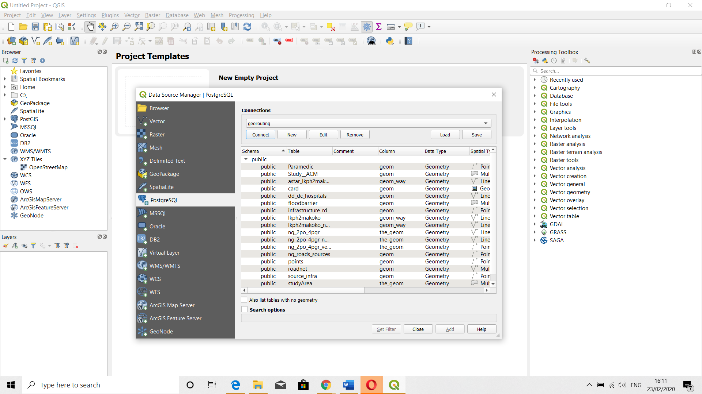
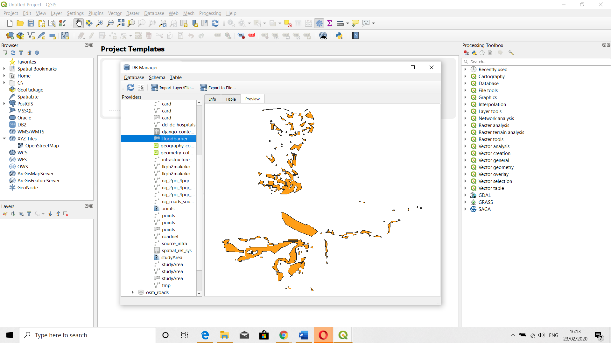

## Creation and Configuration of Database
#### 2.1	About PostgresSQL
PostgreSQL is an object-relational database management system (ORDBMS). PostgreSQL provides PostgreSQL has many advanced features that other enterprise database management systems offer, such as user-defined types, table inheritance, sophisticated locking mechanism, foreign key referential integrity, views, rules, subquery, nested transactions (savepoints), multi-version concurrency control (MVCC), and asynchronous replication. As with all SQL, PostgreSQL consists of six components: (a) the data definition language (DDL), (b) the data manipulation language (DML), (c) the embedded and dynamic SQL, (d) data security, (e) transaction management, and (f) client-server services. For this project, we utilized the DDL, DML, and client-server services. The main reason for its use in this project is that it is the most advanced open-source database system with powerful function and extensibility, which includes pgrouting, PostGIS for spatial database, and the ability to integrate with properly designed network datasets (the Openstreet Map).

PgRouting adds PostGIS to the routing feature. With pgRouting, road network navigation can include complex routing algorithms that meet turning constraints and even time-dependent attributes. PgRouting is an expandable open-source library that offers a variety of tools for the shortest path search as a PostgreSQL and PostGIS extensions.  In this project, we import the data directly from OSM geofabrik into the database, which injects the data of the study area in the correct format with all the right network configuration. Also, we carried out numerous SQL queries with different "Dijkstra" and "A-Star" routing algorithms.

#### 2.2	Creation of Database
To create the database, we connected to the PostgreSQL database server via the pgAdmin tool. By using the pgAdmin application, we interacted with the PostgreSQL database server via an intuitive user interface. The following steps were followed.

* First, launch the pgAdmin application. This application opened on the web browser. The PgAdmin was then used to connect to the server using the proper authentication requirement. Next, we created a new database called testpro.
     
    >*Fig. 2.1 Database creation in PgAdmin 4

* In this database, we ran specific commands to extend the capabilities of the database to carry out the aim of the project.
    
    >*Fig. 2.2 Extending the capabilities of the database*

* Next, we open the Visual Studio Code (VS) Code to integrate and run the osm2po command-line tool to obtain the road network dataset without any difficulty with all the necessary topological characteristics adequately configured.
* The osm2po tool utilized was obtained via the [osm2po](http://osm2po.de/), which makes it very easy to import OpenStreetMap (OSM) data into a Postgres/pgRouting database. It builds the routing network topology automatically and creates tables for feature types and road classes with no network size limitation. The OSM data that is extracted for the osm2po is obtained from [geofabrik](http://download.geofabrik.de/africa/nigeria.html).
* To make the osm2po work properly, the java development kit, as well as the java run environment, was installed.
* The osm2po was configured by editing the database connection in the configuration file appropriately to ensure that the converter parses OSM's XML-Data, makes it a routable data and drops it properly in the right database.
    
    >*Fig. 2.3 Configuring the osm2po tool to sync with the testpro db and to obtain the correct road network for the study area.*

* The db.ini file and the load-into-db.sh were configured, and then the load-into-db.sh and that of the preprocess-osm-roads.sh were executed in the Window subsystem for Linux (wsl) terminal as seen in the image below.
    
    >*Fig. 2.4 WSL Terminal command line to import OSM data and build routing network topology*
* The result of this ng_2po_4pgr table was a complete road network dataset of Nigeria with the appropriate configuration acquired, i.e., pgr_nodeNetwork and the pgr_createTopology already configured.
* With this created, we then used the QGIS DB manager to load the floodbarrier, studyARea, and StudyACM features into the testpro database.
    
    >*Fig. 2.5 Connection to the database via QGIS*

    
    >*Fig. 2.6 Loading the necessary database into Postgres/PostGIS using the DB manager*
* Due to the large size of data from the osm, we took the advice of various materials we sourced to add an index to the source and target column using the code below.
    ``` SQL
        CREATE INDEX source_idx ON ways("source");
        CREATE INDEX target_idx ON ways("target");
    ```
* Next, we used a different SQL command to check the testpro database capabilities by using various available pgRouting algorithm. Most importantly including the clause of barrier into the road network database to achieve the aim of the project
* Since the aim of the project is route automation as regards flood disaster, hence we made our imported road network (ng_2po_4pgr) take cognisance of the floodbarrier by changing values of cost since each of the routing algorithm checks for the least minimum total network weight. This shortest path is usually based on parameters such as distance, time, greenery, etc. 
* As a result, we ran an SQL syntax to update the cost field in the ng_2po_4pgr using the spatial selection || Selection by Location || using ```
    ```SQL
    ST_Intersects.
        ALTER TABLE ng_2po_4pgr
    ADD COLUMN new_cost double precision;

    UPDATE public.ng_2po_4pgr 
    SET new_cost = cost;

    UPDATE public.ng_2po_4pgr 
    SET new_cost = 1e9
    WHERE id IN (
        SELECT n.id
        FROM public.ng_2po_4pgr n
            INNER JOIN public. floodbarrier fb ON 
                ST_Intersects(n.geom_way, fb.geom)
    );
    ```
* Next, we created different SQL to extract all the nodes in the network.
    ```SQL
    CREATE TABLE ng_roads_sources(
        source_id INTEGER NOT NULL,
        geom geometry(Point, 4326)
    );
    INSERT INTO ng_roads_sources
    SELECT source, ST_SetSRID(ST_MakePoint(x1, y1), 4326) AS geom
    FROM ng_2po_4pgr ng, public."studyArea" AS sa
    WHERE ST_Contains(sa.the_geom, ng.geom_way) AND ST_Within(ng.geom_way, sa.the_geom);

    CREATE INDEX ng_roads_sources_geom_idx
    ON ng_roads_sources
    USING GIST (geom);
    ```
* Several other queries were also carried out more; especially, the Dijkstra algorithm was executed using both the new_cost field => cost and the old_cost => ncost (in the ng_2po_4pgr relation). The Dijkstra algorithm takes a beginning node, and an end node generates all possible paths and returns the one(s) with the shortest path (least cost). It doesn’t require other attributes than the source and target ID, id attribute, and cost. It can distinguish between directed and undirected graphs. You can specify if your network has a reverse cost or not.
    ```SQL
    Dijkstra algorithm =	function pgr_dijkstra(text,any array,any array,boolean) :
                            function pgr_dijkstra(text,bigint,any array,boolean) :
    ```
    This was done to validate the shortest path route to ensure it took cognisance of the barrier as applied to the ng_2po_4pgr table. The 
* Other queries were also carried out to explore the capabilities of the pgRouting database as extended.

[Back to the top](#creation-and-configuration-of-database) | [Go Back](Tutorial.md)
______
-----